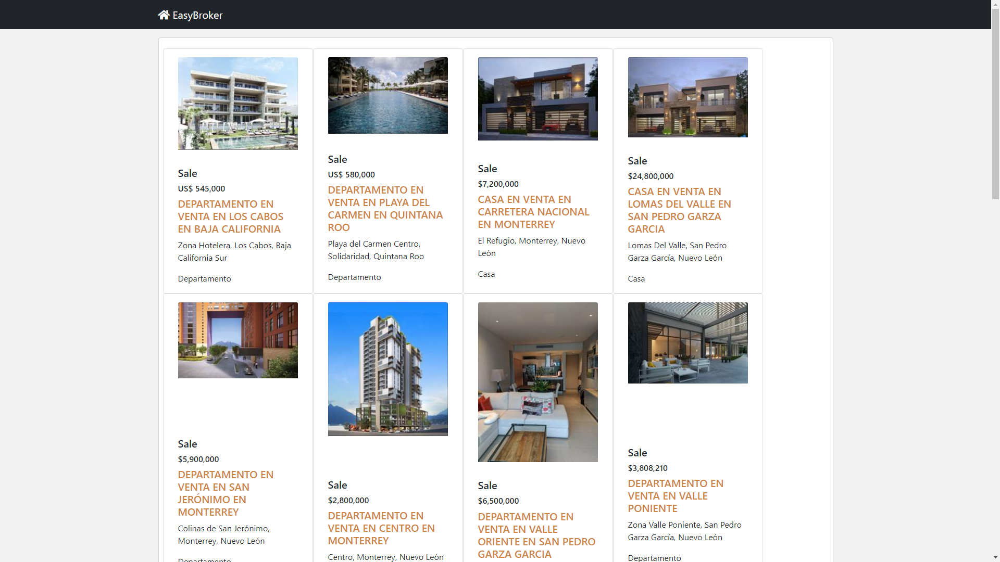
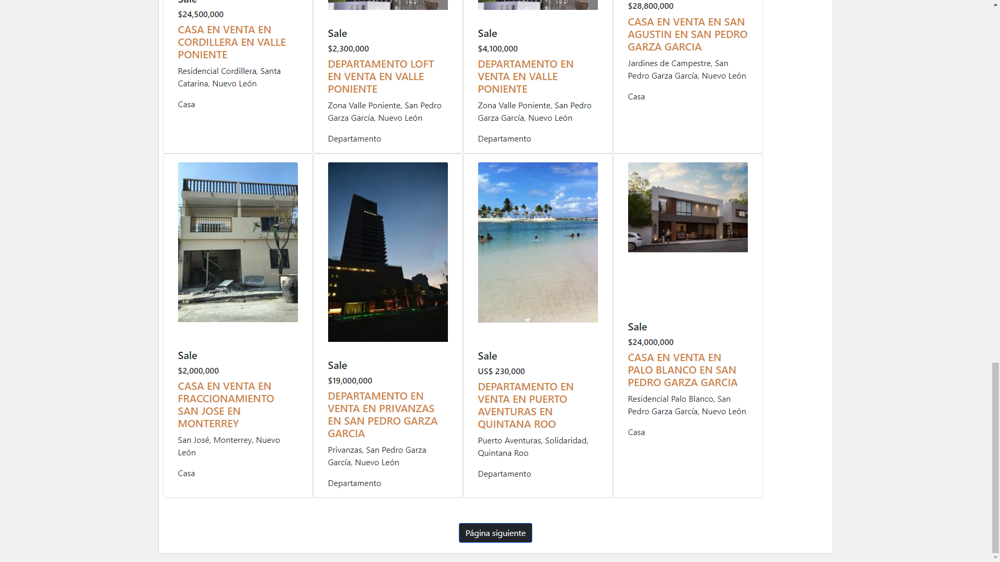

### Inicie Proyecto
```
python -m venv env  || virtualenv -p python3 env
pip install -r requirements.txt
```

### Corra el Proyecto
```
cd .\easyBrokerDjango\ 

python manage.py runserver  
```

#### URL
```
http://127.0.0.1:8000/

```


#### Fotos
```



```